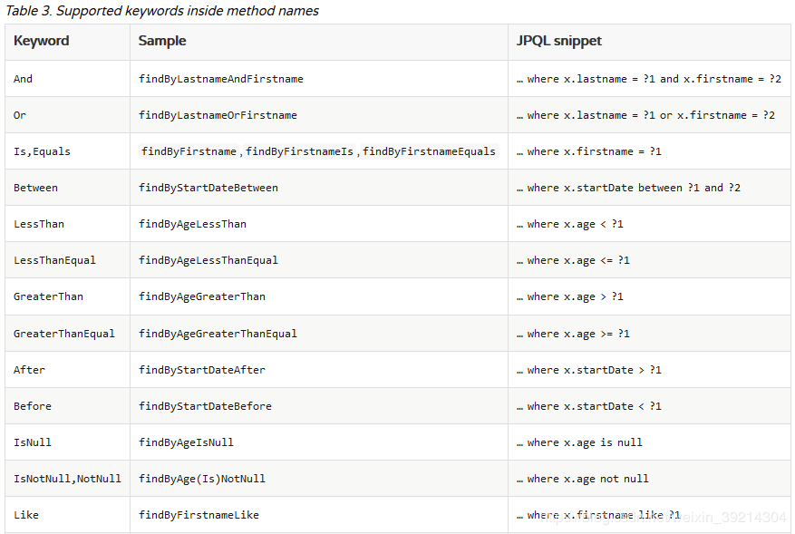
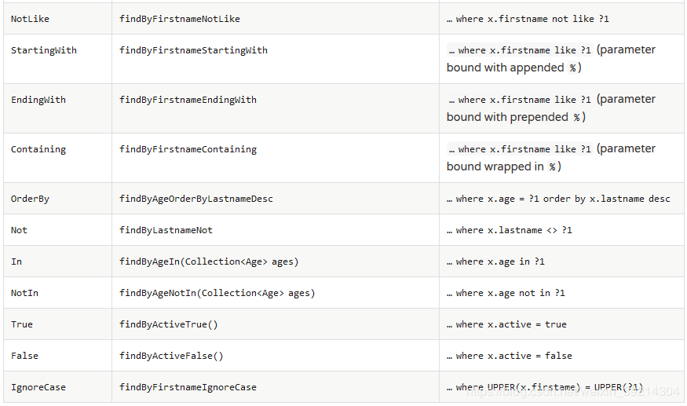

### springboot mongodb使用

使用了jpa的方式进行crud

集群搭建参考：

1. [shard cluster](https://ciweigg2.github.io/2019/10/16/docker-an-zhuang-mongodb-shard-ji-qun/)

2. [replica set](https://ciweigg2.github.io/2019/10/16/mongodb-docker-an-zhuang-mongodb-replica-set-ji-qun/)